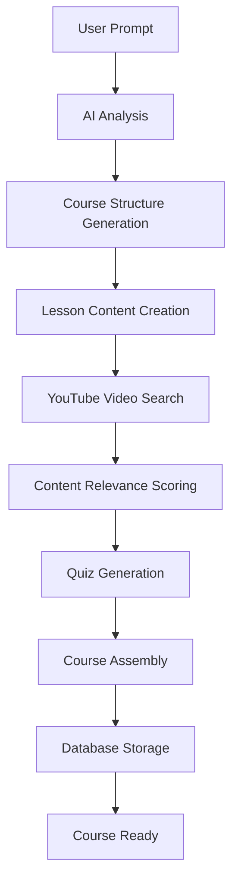

# AI Course Builder Backend

A powerful NestJS backend for an AI-powered course generation system that automatically creates comprehensive courses from simple prompts. Given a topic like "pointers in C++", the system generates multi-lesson courses with embedded YouTube videos, AI-generated quizzes, and curated educational resources.

## 🚀 Features

### Core Functionality
- **Prompt-to-Course Generation**: Transform simple prompts into structured courses
- **AI-Powered Content Creation**: Uses OpenAI/Anthropic for lesson content and quiz generation
- **YouTube Integration**: Automatically finds and embeds relevant educational videos
- **Intelligent Resource Curation**: Scores and filters content for educational value
- **Multi-format Learning**: Supports text, video, interactive content, and assessments
- **Real-time Progress Tracking**: Server-sent events for course generation progress

### AI Integration
- **Multiple AI Providers**: Supports OpenAI GPT-4 and Anthropic Claude
- **Intelligent Fallbacks**: Mock implementations when AI services are unavailable
- **Content Quality Assurance**: Relevance scoring and educational channel whitelisting
- **Adaptive Content Generation**: Context-aware lesson and quiz creation

### Course Management
- **Draft/Published States**: Course lifecycle management
- **User Access Control**: Creator permissions and enrollment system
- **Structured Learning Paths**: Ordered lessons with learning objectives
- **Assessment Integration**: Comprehensive quiz system with multiple question types

## 🏗️ Architecture

### Modular Design
```
src/modules/
├── course-generation/     # Core course generation logic
├── ai-integration/        # AI service integrations (OpenAI, Anthropic)
├── youtube-integration/   # YouTube API and content curation
├── auth/                  # Authentication and authorization
└── health/               # Health checks and monitoring
```

### Database Entities
- **Course**: Main course entity with metadata and status
- **Lesson**: Individual learning units with content and objectives
- **Quiz**: Assessments with configurable scoring and timing
- **QuizQuestion**: Multiple question types (MC, T/F, essay, etc.)
- **Resource**: YouTube videos, articles, and external links
- **Enrollment**: User course progress and completion tracking

## 🛠️ Setup

### Prerequisites
- Node.js 18+
- PostgreSQL 12+
- npm or yarn

### Installation

1. **Clone and install dependencies**:
```bash
cd genai-lms-backend
npm install
```

2. **Environment Configuration**:
Create a `.env` file with:
```env
# Database
DATABASE_HOST=localhost
DATABASE_PORT=5432
DATABASE_USERNAME=your_db_user
DATABASE_PASSWORD=your_db_password
DATABASE_NAME=genai_lms
DATABASE_TYPE=postgres

# AI Services (Optional - uses mocks if not provided)
OPENAI_API_KEY=your_openai_api_key
ANTHROPIC_API_KEY=your_anthropic_api_key

# YouTube API (Optional - uses mocks if not provided)
YOUTUBE_API_KEY=your_youtube_api_key

# JWT
JWT_SECRET=your_jwt_secret
JWT_EXPIRES_IN=24h

# App
NODE_ENV=development
PORT=3000
```

3. **Database Setup**:
```bash
# Start PostgreSQL and create database
createdb genai_lms

# Run migrations (if any)
npm run migration:run
```

4. **Start the application**:
```bash
# Development
npm run start:dev

# Production
npm run build
npm run start:prod
```

## 📚 API Usage

### Generate a Course
```bash
POST /course-generation
Authorization: Bearer <jwt_token>
Content-Type: application/json

{
  "prompt": "pointers in C++",
  "difficulty": "intermediate",
  "lessonCount": 4,
  "includeQuizzes": true,
  "includeVideos": true,
  "targetAudience": ["basic C++ knowledge"],
  "specificTopics": ["pointer arithmetic", "memory allocation", "smart pointers"]
}
```

### Real-time Progress Updates
```javascript
// Subscribe to Server-Sent Events for progress updates
const eventSource = new EventSource('/course-generation/progress/<userId>');

eventSource.onmessage = (event) => {
  const progress = JSON.parse(event.data);
  console.log(`${progress.stage}: ${progress.progress}% - ${progress.message}`);
};
```

### Retrieve Generated Course
```bash
GET /course-generation/<courseId>
Authorization: Bearer <jwt_token>
```

## 🤖 AI Integration

### Supported Providers
1. **OpenAI GPT-4**: Primary provider for content and quiz generation
2. **Anthropic Claude**: Alternative provider with structured outputs
3. **Mock Service**: Fallback when no API keys are provided

### Content Generation Pipeline
1. **Course Structure**: AI analyzes prompt and creates lesson outline
2. **Content Creation**: Detailed lesson content generated for each topic
3. **Resource Curation**: YouTube videos found and scored for relevance
4. **Quiz Generation**: Assessments created based on lesson content
5. **Quality Assurance**: Content filtering and educational scoring

### Educational Channel Whitelist
Pre-configured list of high-quality educational channels:
- Programming with Mosh
- freeCodeCamp.org
- The Coding Train
- Fireship
- Web Dev Simplified

## 📊 Course Generation Flow



## 🔒 Security Features

- **JWT Authentication**: Secure user authentication
- **Role-based Access**: Creator and student permissions
- **Input Validation**: Comprehensive DTO validation
- **Rate Limiting**: API throttling and abuse prevention
- **CORS Configuration**: Cross-origin request security

## 🚦 Error Handling

### AI Service Failures
- Automatic fallback to alternative providers
- Mock data generation when all services fail
- Detailed error logging and user notifications

### Content Validation
- Relevance score thresholds for video inclusion
- Educational channel verification
- Content length and quality filters

### Database Resilience
- Transaction management for multi-step operations
- Rollback mechanisms for failed generations
- Connection pooling and retry logic

## 📈 Monitoring and Analytics

### Health Checks
```bash
GET /health
```

### Course Generation Metrics
- Success/failure rates
- Average generation time
- AI service usage statistics
- User engagement metrics

## 🧪 Testing

```bash
# Unit tests
npm run test

# E2E tests
npm run test:e2e

# Test coverage
npm run test:cov
```

## 🚀 Production Deployment

### Docker Support
```dockerfile
# Build and run with Docker
docker build -t genai-lms-backend .
docker run -p 3000:3000 genai-lms-backend
```

### Environment Variables
Ensure all production environment variables are set:
- Database credentials
- AI API keys
- JWT secrets
- CORS origins

## 🔮 Future Enhancements

### Planned Features
- **Multi-language Support**: Course generation in multiple languages
- **Advanced Analytics**: Learning path optimization and user insights
- **Content Versioning**: Track and manage course updates
- **Integration APIs**: Connect with external learning platforms
- **Mobile SDK**: React Native/Flutter integration support

### AI Improvements
- **Custom Model Training**: Domain-specific course generation
- **Content Personalization**: User-adaptive learning paths
- **Automated Grading**: AI-powered assessment evaluation
- **Voice Integration**: Audio lesson generation and narration

## 🤝 Contributing

1. Fork the repository
2. Create a feature branch
3. Make your changes
4. Add tests for new functionality
5. Submit a pull request

## 📄 License

This project is licensed under the MIT License.

## 🆘 Support

For issues and questions:
- Create an issue on GitHub
- Check the documentation
- Review the test examples

---

**Built with ❤️ for the future of AI-powered education**
